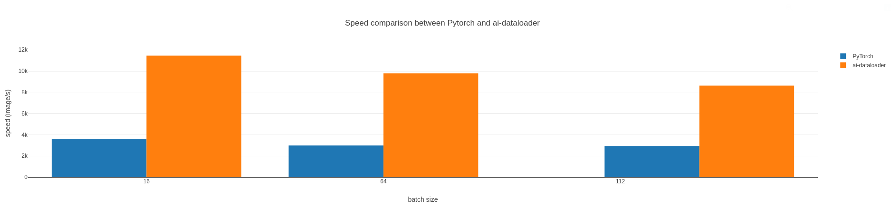

# Dataloader benchmark

Compare [ai-dataloader] and [PyTorch] speed on different datasets.

Mainly inspired by this [paper] which github is available [here].

## Run locally

Instruction will be soon added. [poetry] is needed to install pytorch.

## Result

On my machine I observe a 217% speedup for the mono-threaded version, with random image dataset.

[poetry]: https://python-poetry.org/docs/
[ai-dataloader]: https://github.com/Tudyx/ai-dataloader
[PyTorch]: https://github.com/pytorch/pytorch
[paper]: https://arxiv.org/abs/2209.13705
[here]: https://github.com/smartnets/dataloader-benchmarks
